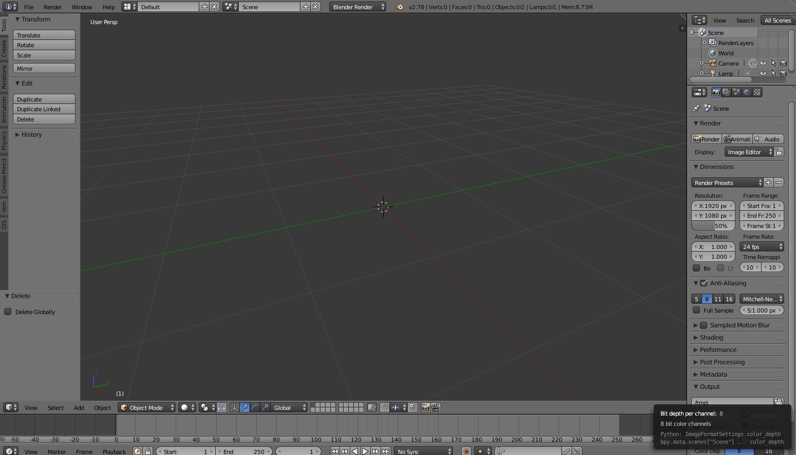
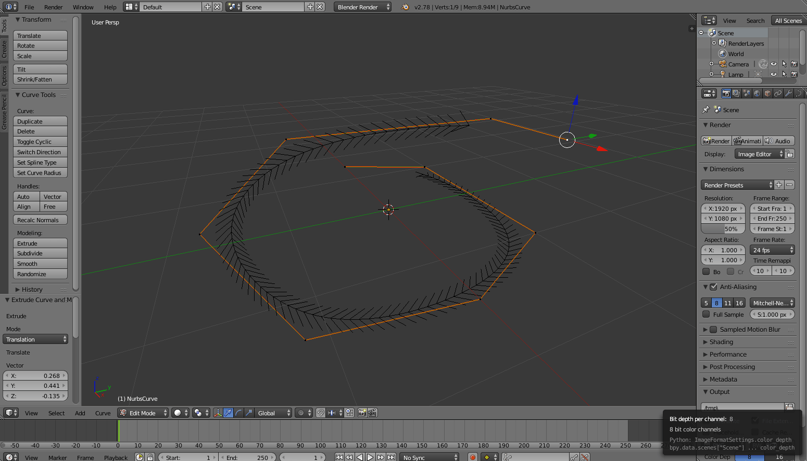

# Blender Curve coordinate points
Displays a list of coordinate points of a curve in an array to use for Three.js

1. Create a Bezier or Nurbs curve in Blender (Make sure it's selected) 
 
2. Open the text editor and click open  
3. Open the <em>export_curve_points.py</em> file and click run  
4. Go to Windows > Toggle System Console to see the list of x,y,z coordinates for that curve 

